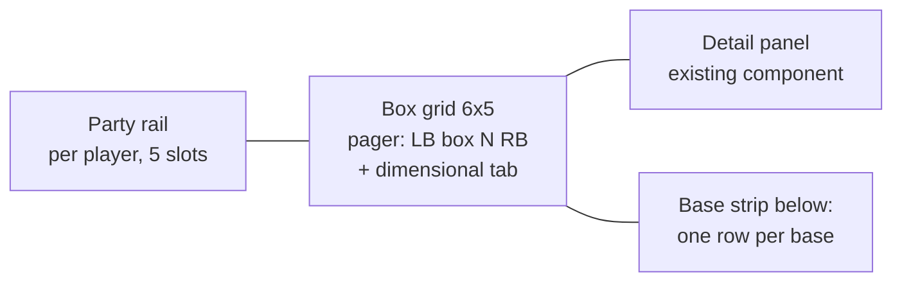

# Palbox View — plan (not yet built)

Refactor Save Inspector's main surface into the in-game Palbox layout (user request,
2026-07-21; reference: in-game screenshot — party rail left, box grid center with pager,
detail panel right, base-pals strip below).

## Data feasibility — everything needed is already parsed

| In-game element | Our data | Notes |
|---|---|---|
| Party rail (5 slots) | `container_kind == Party` + `owner_player_uid` | 4 players on the server save → needs a player switcher the game doesn't have |
| Box grid pages | `container_kind == Palbox` + `slot_index` | box = `slot / 30`, cell = `slot % 30`, 6×5 grid like the game; render trailing empty slots |
| "Pal who is at the base" strip | `container_kind == Base` grouped by `container_id` | 6 bases in test save; base *names/coords* not parsed yet (GroupSaveDataMap has them — optional pal-save extension) |
| Dimensional storage | per-player `_dps.sav` pals | pages of 30, show only occupied pages (9600-slot container) |
| Detail panel right | built in iteration 2 (roster detail panel) | reuse as-is; matches the game's right panel already |

## Layout (1280 base)

## Decisions (confirmed by user, 2026-07-21)

1. **Player switcher**: YES — tabs above the party rail, remember last selection.
2. **Slot styling**: circular game-style slots in the grid (level ring, gender dot, alpha symbol); cards stay in list mode.
3. **Table view kept** as list-mode toggle. REQUIREMENT: replicate the in-game palbox sort/search feature set ("pretty in depth") and apply it to BOTH views — spec researched in `PALBOX-SORT-SPEC.md` before build.
4. **Search behavior**: HIDE non-matching slots (not dim).
5. **Grid sorting**: fully sortable/searchable like the game — virtual reorder (flatten → sort → repaginate); a "slot order" sort restores physical layout. (Read-only: we never rearrange the actual save.)

Data gap being closed pre-build: per-species element types (in-game filters are element-driven) — sourced from a permissively-licensed community dataset into the pack; also unlocks element badges in the Pal-dex.

## Build slices (one designer round + polish)

1. Pure-TS grouping selectors (pals → player → containers → pages) + unit-ish tests in vitest or plain TS asserts.
2. `PalboxGrid`, `PartyRail`, `BaseStrip`, pager components (UI-DESIGN tokens; circular slot primitive).
3. Wire selection → existing detail panel; keyboard nav (arrows move cell, LB/RB = box pager like the game).
4. Optional pal-save extension: base names/positions from GroupSaveDataMap for the base strip headers.
5. Screenshot loop incl. empty boxes, dimensional tab, 1024 width.
